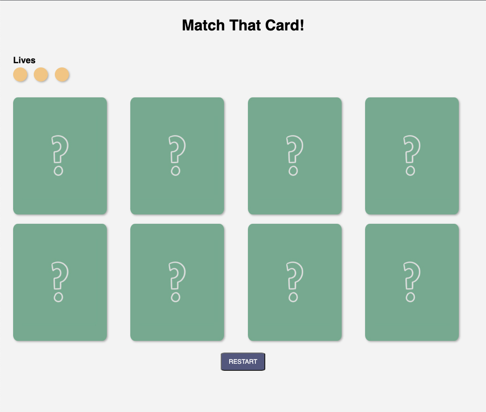
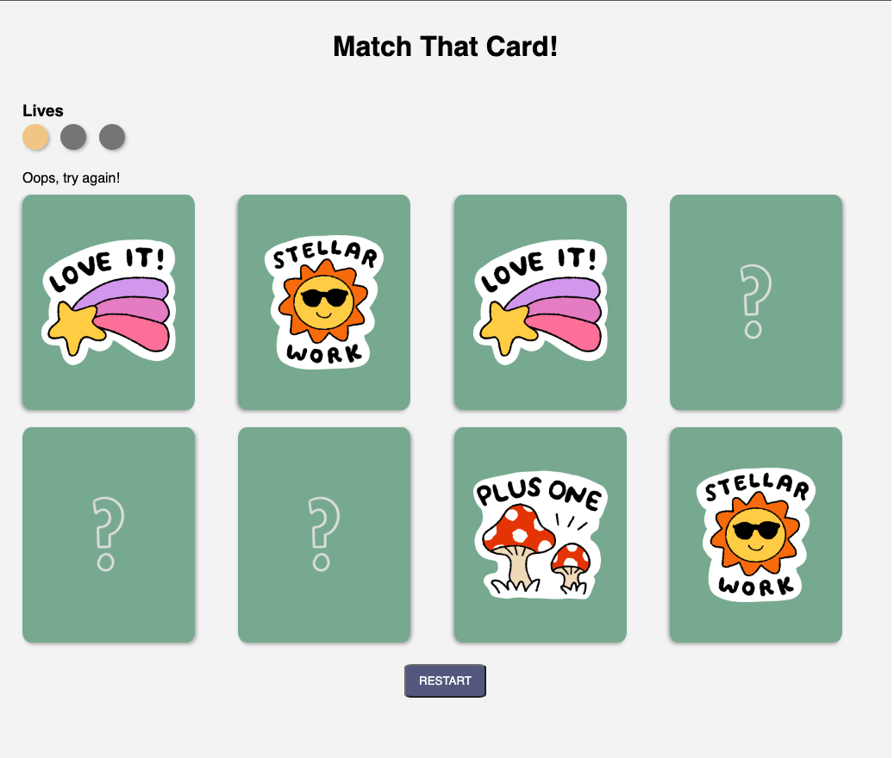
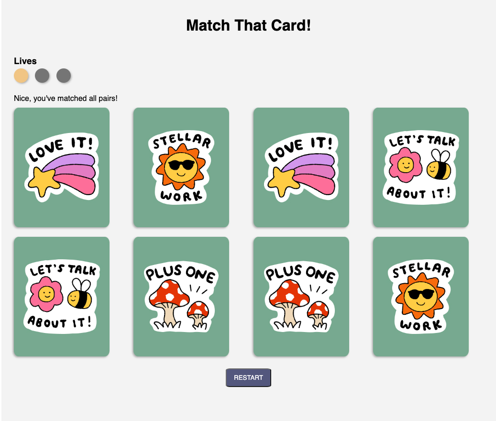

# Match That Card!
Put your memory to the test! This game will test how well you can remember a card's image to find its matching pair.

## Getting Started
- Select a card, then select another card to match its pair
- If the second card does not match the first, select a new second card
- You have 3 chances (lives) to match all pairs
- Click the "Restart" button to restart the game

## At a glance
Here's what the game looks like at a glance:

<figure>
    <figcaption>Start of the game</figcaption>
    
</figure>

<figure>
    <figcaption>Wrong match</figcaption>
    
</figure>

<figure>
    <figcaption>Game won!</figcaption>
    
</figure>

## Technologies used
- HTML
- CSS
- vanilla JavaScript
- FigJam stickers

---

## Future editions

### Version 2
- As a user, I want to gain a life back if I get 3 matches in a row

- As a user, I want the cards to shuffle with a new set of cards when I restart the game

- As a user, I want to race against a timer to complete the game

- As a user, I want to choose how many cards I want to match

### Version 3
- As a user, I want to race with another player