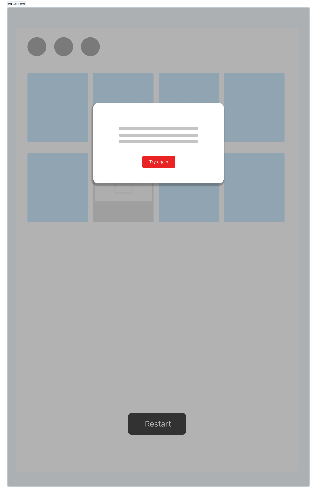

# Match That Card!
Put your memory to the test! This game will test how well you can remember a card's image to find its matching pair.

## Getting Started
- Select a card, then select another card to match its pair
- If the second card does not match the first, select a new second card
- You have 3 chances (lives) to match all pairs
- Click the "Restart" button to restart the game

## At a glance
Here's what the game looks like at a glance:

<figure>
    <figcaption>When you lose all lives</figcaption>
    
</figure>

---
## Technologies used
- HTML
- CSS
- vanilla JavaScript
- FigJam stickers
---

## User stories

### Version 1

1. As a user, I want to start a new game
```js
let game
const buttonStartGame
const messagePrompt
const lives
```

2. As a user, I want to have a total of 3 chances (lives) to match all cards
```js
let chances = 3
let success = []
let turns = []
```

3. As a user, I want to view 8 cards that are faced "down"
```js
const board
const cardItem
class Card
    construct domElement and this.value attributes
    FUNCTION render
        assign image by random to card
```

4. As a user, I want to be able to click on a card to reveal what image it is
```js
const firstCard
const secondCard

class memoryGame
    FUNCTION play

    cardItem.addEventListener('click', event => {
    })
```

5. As a user, I want to be able to click on another card while the first card is still revealed
```js
WHILE firstCard is still showing
```

6. As a user, I want to know if I've successfully matched the card
```js
IF firstCard matches secondCard
    show success message
```

7. As a user, I want to know if I mismatched a card 
```js
ELSE
    chances.push('mismatch')
```

8. As a user, I want to see how many lives I have left
```js
(add to ELSE statement)
    change domElement of life circles to grey color
```

9. As a user, I want the second selected card to be faced down if it doesn't match the first selected card
```js
(add to ELSE statement)
change firstCard and secondCard background color back to original to conceal image
```

10. As a user, I want to have another chance to match the first card if the 2nd card selected doesn't match
```js
IF chances.length != 3
function play
```

11. As a user, I want to be able to restart the game at any point in time
```js
const restartButton
restartButton.addEventListenter('click', event => {
    set chances to empty array
    cardItems background color set to randomized images
})
```

12. As a user, I want to begin a new game when I lose or win the game
```js
FUNCTION getWinner
(within render function of memoryGame class)
IF chances.length === 3
alert to restart game
```

### Version 2
1. As a user, I want to gain a life back if I get 3 matches in a row
```js
const matches = ''
(set as a counter)
const turn
(on the secondCard)
IF turn is 1
    matches ++
ELSE
    matches --
```
*need to revisit how to only track secondCard turn for consecutive wins*

2. As a user, I want the cards to shuffle with a new set of cards when I restart the game
```js
cards = [an array of images]
cardIndex = cards.length
function shuffleCards(){
    WHILE (cardIndex){
        newIndex = Math.floor(Math.random * cardIndex)
        cardIndex--
    }
}
```

3. As a user, I want to race against a timer to complete the game
```js
const timer
(add to IF chances.length === 3 statement)
|| setTimeout(FUNCTION, time length)
```

4. As a user, I want to choose how many cards I want to match
```js
cardOption.addEventListener('click', setNumberOfCards)
```


### Version 3
1. As a user, I want to race with another player
```js
const playerOne
const playerTwo
```